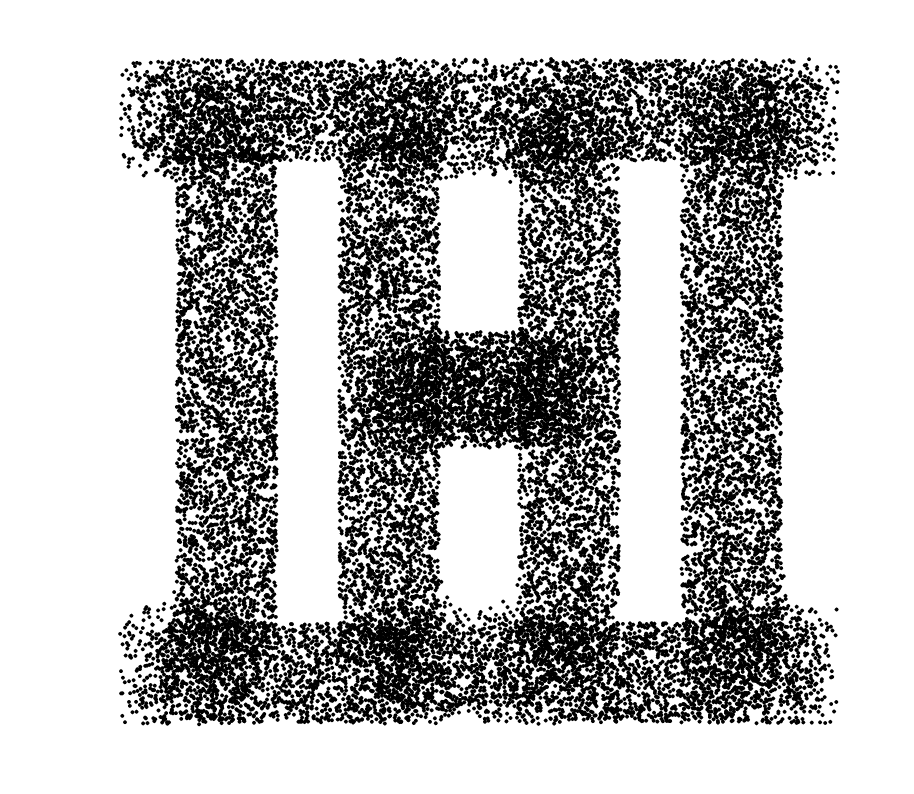
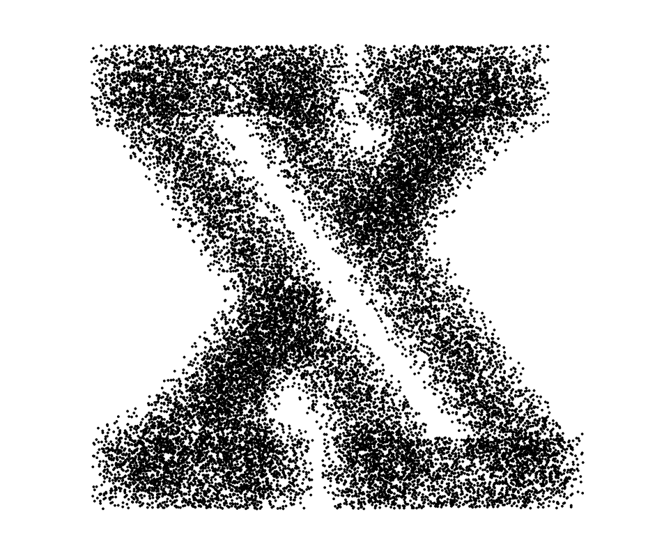
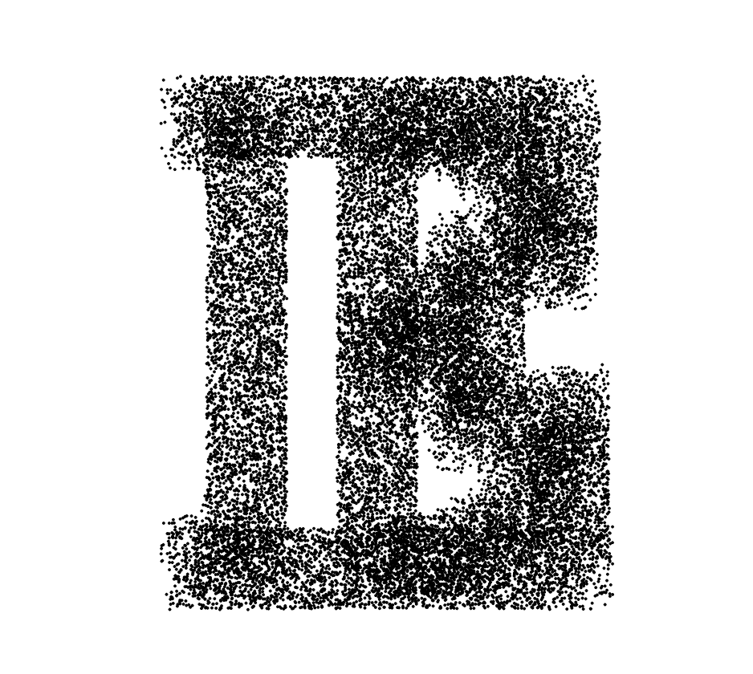

# Playfair RandomSpread
A typography experiment with javaScript

Working example:
https://matthias-jaeger-net.github.io/PlayfairRandomSpread/

Playfair Random Spread – Is a typography experiment using the delicate path of Claus Eggers Sørensens  typeface Playfair Display as a base for further random spread, resulting in  an animation, drawn in a HTML5 <canvas> element  This program takes a single capital letter, in the given font, as an input.  After analyzing the bounding box of the letter it is centered on the screen.  An array of vectors is calculated by tracing the path of the given letter. Each frame of the animation the traced points are spread by a random ammount. If the user presses the correct key an svg image is offered.  

Playfair Display specimen:  
https://fonts.google.com/specimen/Playfair+Display  

Rendering with p5js:  
http://p5js.org/
